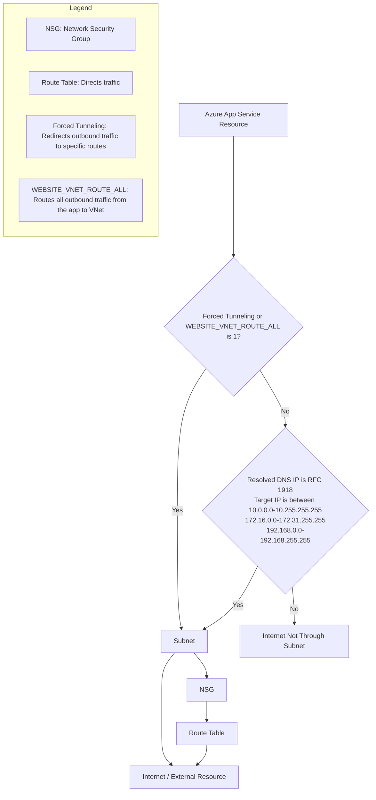

# AzureDeployTest

```mermaid
graph TD
    A[Azure App Service Resource] --> F{Forced Tunneling or WEBSITE_VNET_ROUTE_ALL is 1?}
    F -- Yes --> B[Subnet]
    F -- No --> G{Resolved DNS IP is RFC 1918<br />Target IP is between <br />10.0.0.0-10.255.255.255<br />172.16.0.0-172.31.255.255<br />192.168.0.0-192.168.255.255}
    G -- Yes --> B[Subnet]--> E[Internet / External Resource]
    G -- No --> H[Internet Not Through Subnet]
    B --> C[NSG]
    C --> D[Route Table]
    D --> E[Internet / External Resource]

    %% Legend
    subgraph Legend
        L1[NSG: Network Security Group]
        L2[Route Table: Directs traffic]
        L3[Forced Tunneling: Redirects outbound traffic to specific routes]
        L4[WEBSITE_VNET_ROUTE_ALL: Routes all outbound traffic from the app to VNet]
    end
```
